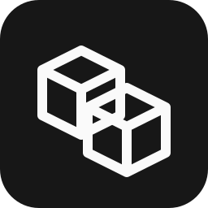
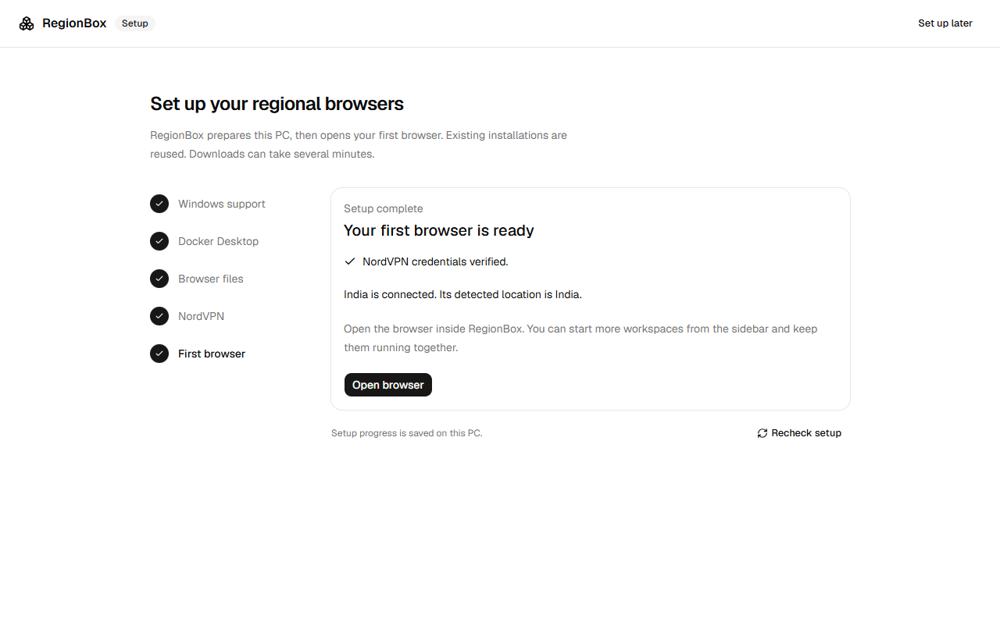
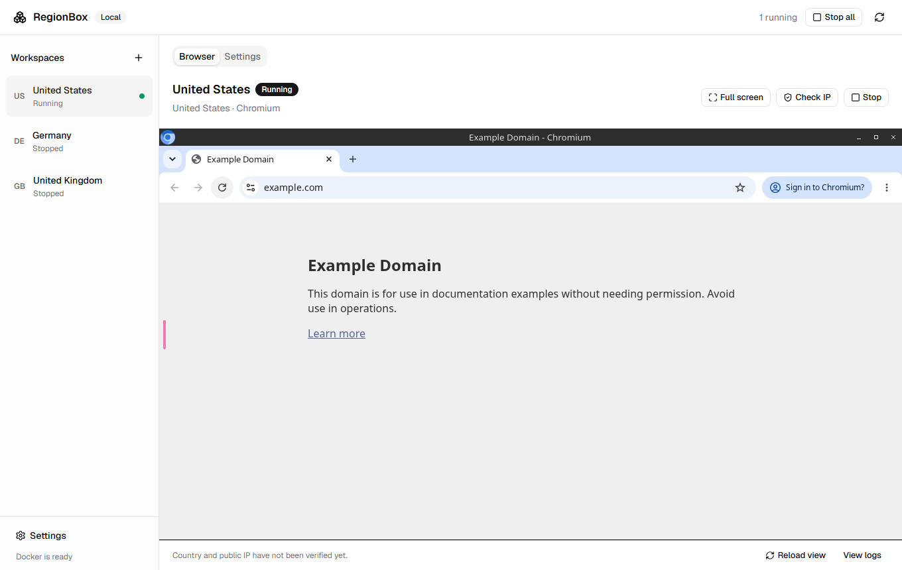

<p align="center">
  
</p>

<h1 align="center">RegionBox</h1>

<p align="center">Independent browser workspaces. Different countries. One desktop.</p>

<p align="center">
  <a href="https://github.com/jayanth-mkv/region-box/releases/latest"></a>
  <a href="https://github.com/jayanth-mkv/region-box/actions/workflows/windows.yml"></a>
  <a href="#install-and-share"></a>
</p>

<p align="center">
  <a href="https://github.com/jayanth-mkv/region-box/releases/latest"><strong>Download for Windows</strong></a>
  &nbsp;·&nbsp;
  <a href="#install-and-share">Getting started</a>
  &nbsp;·&nbsp;
  <a href="#run-from-source">Build from source</a>
  &nbsp;·&nbsp;
  <a href="SECURITY.md">Security</a>
</p>

<p align="center">Run several Chromium sessions at once, each with its own NordVPN connection and saved browser profile.</p>

<p align="center">
  
</p>
<p align="center">
  
</p>

<p align="center"><sub>A Chromium workspace running inside RegionBox.</sub></p>

---

## Install and share

Download the setup EXE from [GitHub Releases](https://github.com/jayanth-mkv/region-box/releases/latest). Share that release link or the installer. Each person enters their own NordVPN service credentials; no account data is included.

Share the Windows installer in `src-tauri/target/release/bundle/nsis/`. Recipients do not need Node.js, Rust, the source project, or your credentials. The installer installs RegionBox for the current Windows user and installs WebView2 if needed. This prototype is unsigned.

On first launch, **Setup** walks through five steps:

1. **Windows support:** checks WSL and virtualization. **Set up this PC** installs or updates missing WSL support using Windows' administrator prompt. Restart Windows when asked, then reopen RegionBox.
2. **Docker Desktop:** downloads Docker's official installer, checks its Windows signature, installs it for the current user, and opens Docker. Complete any terms or first-run prompts in Docker's window. RegionBox waits for its Linux engine and Compose to respond.
3. **Browser files:** downloads the VPN and Chromium images. Existing installations and downloaded images are reused.
4. **NordVPN:** enter service credentials and select **Check and continue**. Setup tests a real VPN connection before saving them or continuing. Saved credentials can be checked again without re-entering them.
5. **First browser:** choose a country, connect, and check the detected IP country before opening the embedded browser.

The app cannot enable virtualization in BIOS/UEFI, accept an administrator prompt for you, or restart your PC automatically. It explains when these actions are needed. **Set up later** opens the workspace screen; return through **Settings → Setup & checks**. Setup does not show local credential-file paths.

## Countries and workspaces

**India · United States · United Kingdom · Australia · Canada · United Arab Emirates · France · Singapore · Germany · Netherlands**

Create up to 10 independent workspaces. Each has its own Chromium profile and VPN connection; stopping one preserves its browser data and leaves the others running.

RegionBox selects NordVPN's recommended servers and downloads connection files automatically. No manual server configuration is needed. Recommendations do not guarantee the fastest speed; the app checks connectivity rather than benchmarking every server.

## Run from source

Prerequisites: Docker Desktop using Linux containers and WSL2, Node.js 22.12+, Rust, Microsoft C++ build tools, and WebView2.

```powershell
rtk npm ci
rtk npm run desktop
```

The three country workspaces are created on first launch. Follow Setup or open **Settings** and enter your NordVPN **service credentials**, available in Nord Account → NordVPN → Set up NordVPN manually. These differ from your normal email and password. Both screens include a short guide and a link to Nord Account. The connection check can take a few minutes as unavailable servers are retried; login rejection and connection failure show different messages. Verification is repeated after reopening the app.

During development you can fill `.env` in the project root instead. Copy `.env.example` to `.env` if needed. The app reads it again whenever you start a workspace or refresh status. Never commit this file or share it in chat.

Select a workspace and click **Start workspace**. First use downloads the browser and VPN images. When both are healthy, the browser opens inside RegionBox. Start another workspace to browse through another country at the same time. Switching the selected workspace does not stop the others.

**Check IP** requests Cloudflare's connection trace from inside the browser container. RegionBox shows the detected public IP, country, and check time; a country mismatch is shown explicitly. This is IP geolocation, not GPS location.

## Build a Windows installer

GitHub Actions builds a Windows x64 installer on pushes to `main`/`dev`, pull requests to `main`, and manual runs. Download **RegionBox-VERSION-windows-x64** from the completed [Windows installer workflow](https://github.com/jayanth-mkv/region-box/actions/workflows/windows.yml). A successful `vVERSION` tag build publishes the EXE and `SHA256SUMS.txt` to GitHub Releases, where anyone can download them without signing in.

The workflow scans Git history for secrets, checks publication safety, runs Rust unit tests and UI fixtures, then packages the app. It requires no NordVPN credentials and does not upload logs, screenshots, profiles, or the source workspace. Native Docker/VPN checks remain local; GitHub's Windows runner does not run those checks.

For a release, update the version in `package.json`, `package-lock.json`, `src-tauri/Cargo.toml`, `src-tauri/Cargo.lock`, and `src-tauri/tauri.conf.json`, commit, then push an annotated `vVERSION` tag. The workflow rejects a tag that differs from the app version. Already published installers are not overwritten.

For a quick standalone prototype executable:

```powershell
rtk npm run desktop:prototype
```

Open `src-tauri/target/debug/regionbox.exe`. This prototype build reads the project's `.env` and runs without a development web server.

For an installer:

```powershell
rtk npm run desktop:build
```

The installer is written to `src-tauri/target/release/bundle/nsis/`. The first-run setup installs Docker Desktop separately when it is missing. The app is unsigned in this prototype.

The installed app stores settings and credentials under `%LOCALAPPDATA%\com.regionbox.desktop`. It does not include your development `.env`. Enter the service credentials in the installed app's Settings.

## Controls

- **Create workspace:** adds another independent profile in any of the ten supported countries.
- **Full screen / Exit full screen:** expands the browser inside the app while keeping an exit button visible.
- **Start / Stop:** controls only the selected browser and VPN pair.
- **Stop all:** stops all workspaces owned by this RegionBox installation.
- **Reload view:** reconnects the viewer without restarting Chromium.
- **View logs:** shows recent container diagnostics with known credentials redacted.
- Closing the app offers to stop workspaces or leave them running in Docker.

## Storage and network behavior

- Workspace settings live in `workspaces.json` in the app data folder.
- Browser data lives in Docker volumes named `regionbox-<installation>-<workspace>_profile`.
- The app never removes profile volumes. Do not run Docker volume pruning if you need saved profiles.
- NordVPN credentials are stored locally as plain text. Compose mounts credential files as secrets; passwords are not embedded in the Compose document or passed on command lines.
- Each browser shares only its own VPN's network namespace. Its DNS resolver points to Gluetun in that namespace. IPv6 is disabled for this MVP.
- Gluetun's firewall remains enabled. Browsers start only after the VPN health check passes.
- Chromium's internal sandbox remains enabled. Password saving is disabled; use your password manager. Camera and microphone forwarding are disabled.
- After installing a browser update, stop and start existing workspaces once to apply it. Saved profiles remain intact.
- Browser viewer ports bind only to `127.0.0.1` and require a private per-workspace access token, which RegionBox supplies automatically. This version is for use on the same PC.
- Windows commands target Docker Desktop's `desktop-linux` context. No host VPN switching is required.
- Each running workspace uses one VPN connection and consumes additional RAM. Start two first on a busy 16 GB PC.

## Verification

```powershell
rtk npm run build
rtk npm run test:core
```

Native UI, Chromium viewer, and live VPN verification are documented in `docs/testing.md`. The live country, reconnect, and VPN-loss checks require valid NordVPN service credentials. A successful build alone does not establish those checks passed.

Before publishing, run `npm run check:public`. Read [SECURITY.md](SECURITY.md) for private-data handling and commit-email privacy.

## References

- [Gluetun NordVPN configuration](https://github.com/qdm12/gluetun-wiki/blob/main/setup/providers/nordvpn.md)
- [LinuxServer Chromium](https://docs.linuxserver.io/images/docker-chromium/)
- [shadcn Vite setup](https://ui.shadcn.com/docs/installation/vite)
- [Docker Desktop Windows installation and installer flags](https://docs.docker.com/desktop/setup/install/windows-install/)
- [Windows WSL installation commands](https://learn.microsoft.com/en-us/windows/wsl/basic-commands)

The UI uses components generated from shadcn's official registry. RegionBox manages interactive sessions; browsing and account sign-in are manual.
